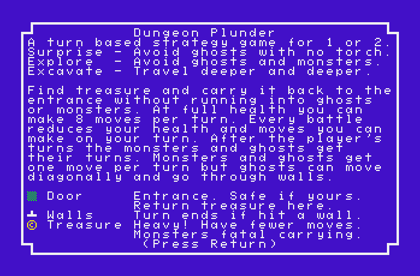
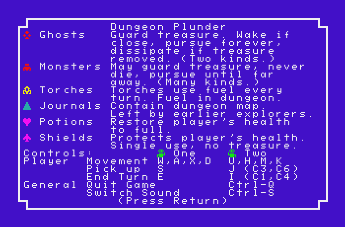
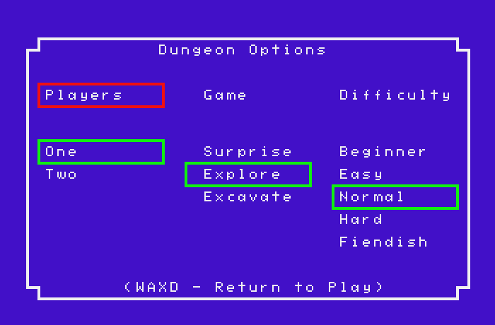
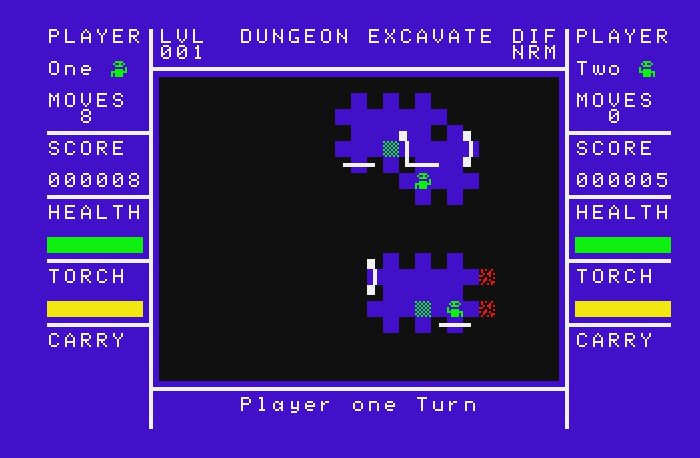
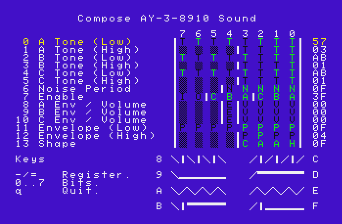

# Dungeon Plunder for Mattel Aquarius

The aquarius version works with the base model but also supports the expansion module, enhanced sound, and joysticks.

Welcome Screen:

Instructions:

Options:

Gameplay:

Easter Egg - Sound Composer:

