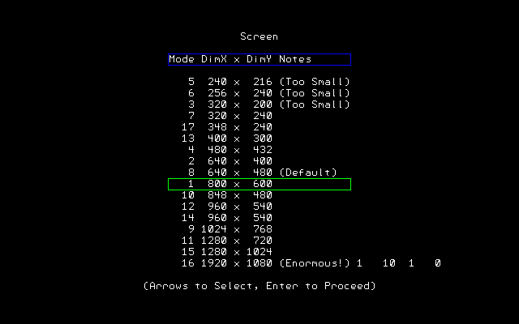
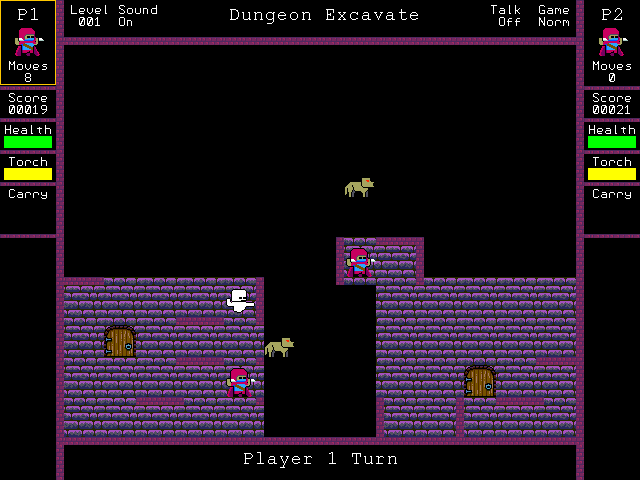
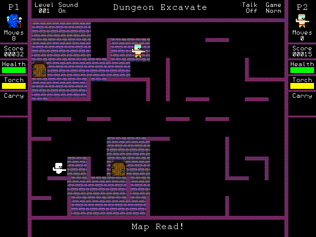
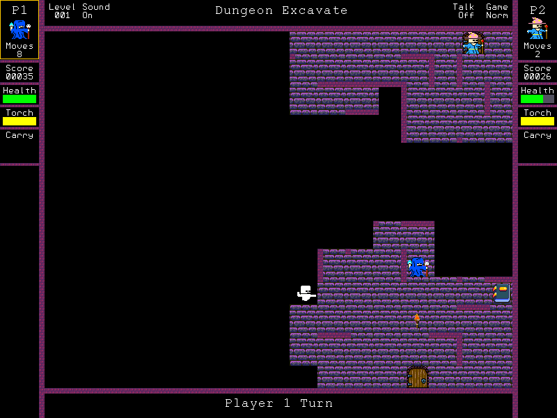
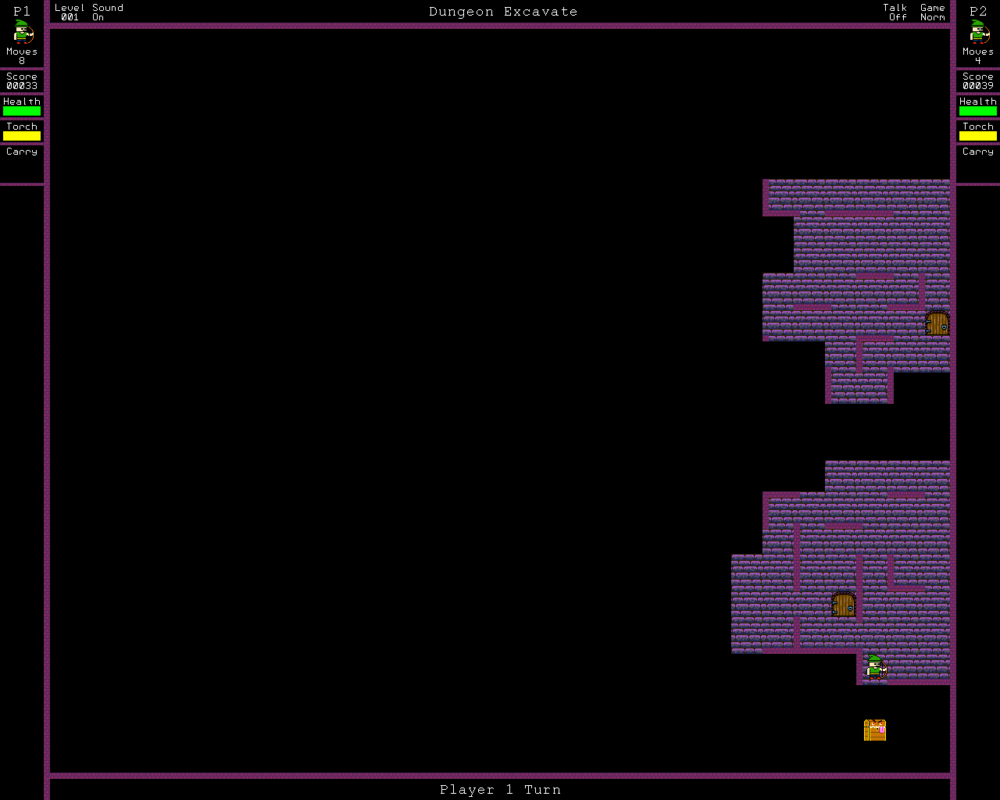
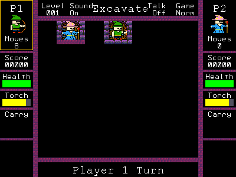
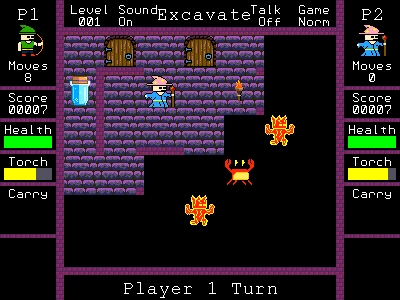

# Dungeon Plunder for the Colour Maximite Gen 2.

\
\
The original prototype of Dungeon Plunder.\
As a prototype it doesn't have elements of later versions like the shield. \
This version supports a variety of screen resolutions, maze sizes, sound, speech, joysticks, and numchuk controllers.\
\
\
Welcome Screen:\

\
\
Screen Resolutions:\

\
\
Options:\

\
\
Gameplay:\

\
\
