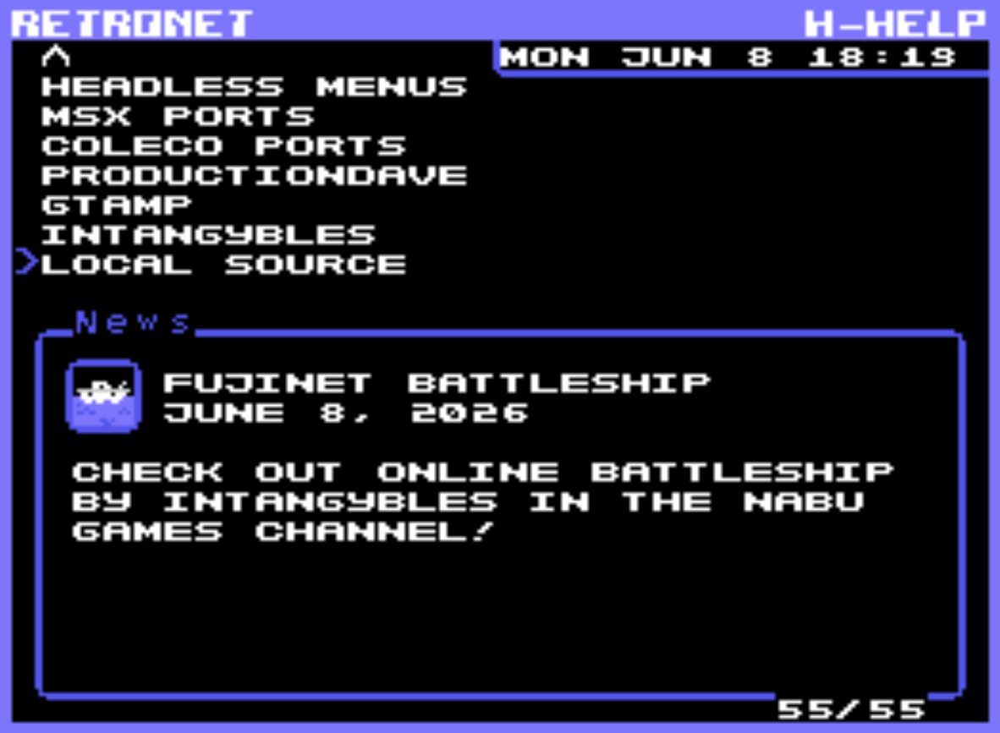
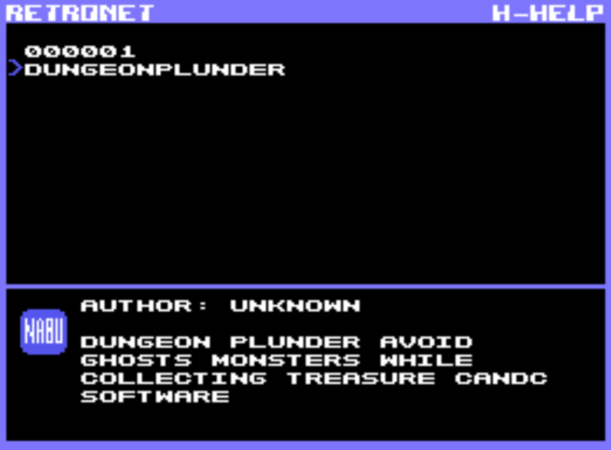
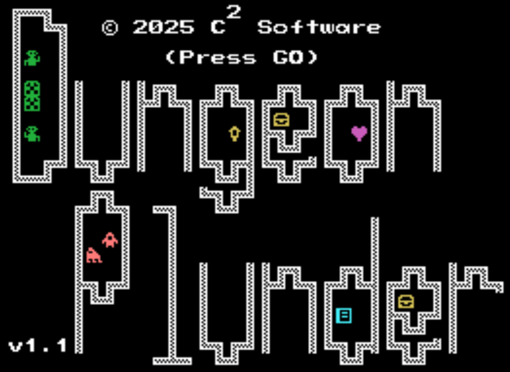
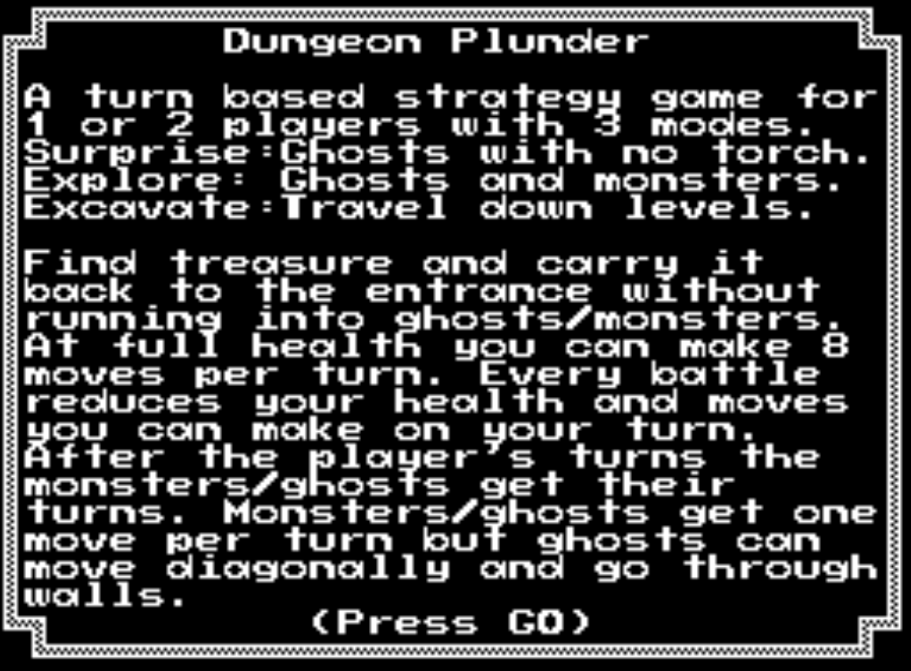
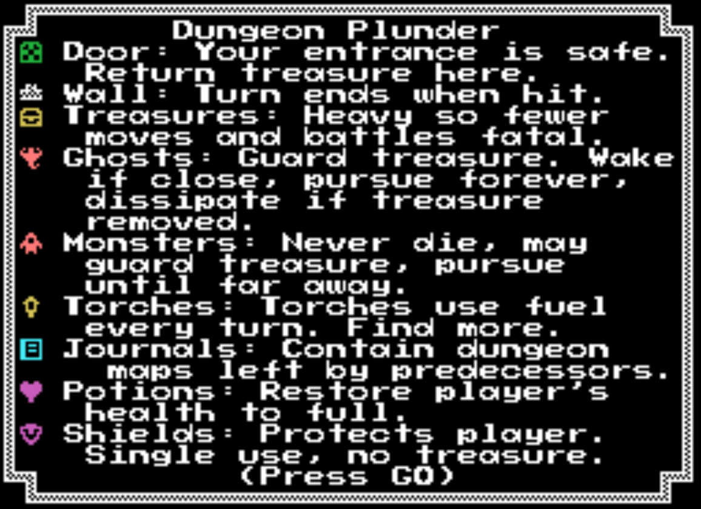
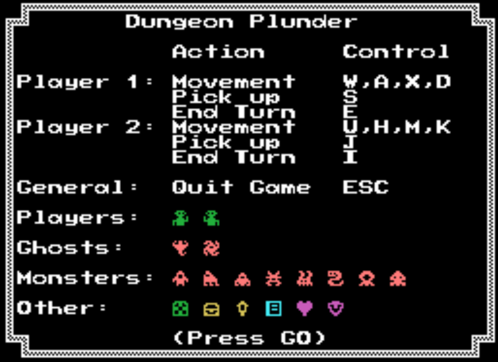
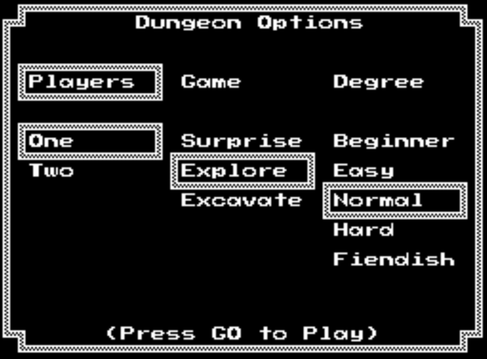
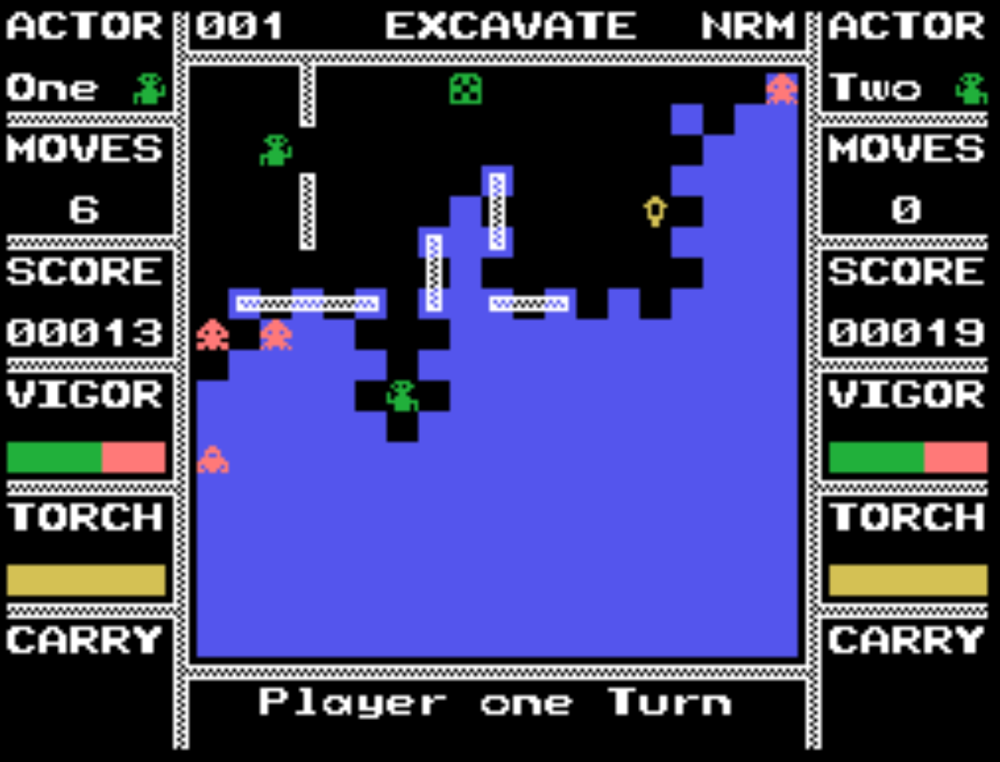
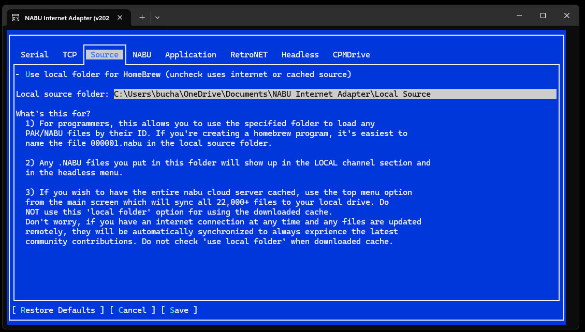

# Dungeon Plunder for the NABU
\
\
A native port, not an MSX conversion. Supports the Nabu keyboard. Run from the "local source folder".
\
\
\
\
Demo Computer:\

\
\
NABU Launch:\

\
\
Welcome Screen:\

\
\
Instructions:\

\
\
Options:\

\
\
Gameplay:\

\
\
Internet Adapter Setup:\

\
\
Release: [Binary](Releases/DungeonPlunder.nabu)
\
\

