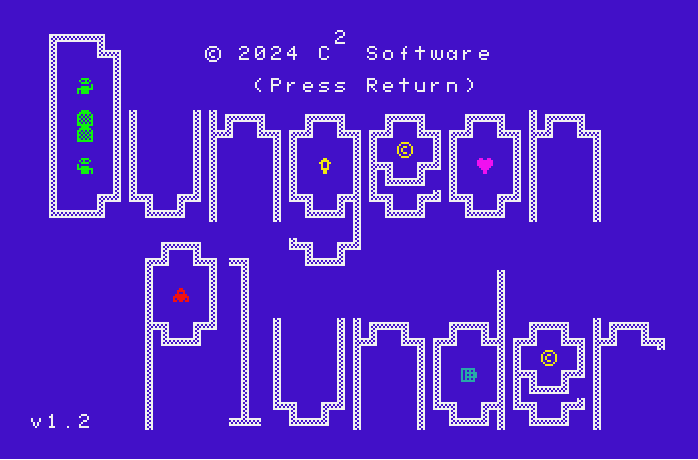
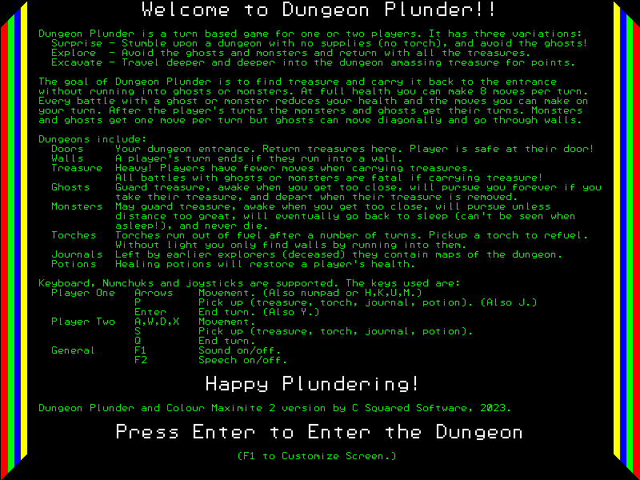

# Dungeon Plunder

Dungeon Plunder is a turn based, strategy game, for one or two players. It was protyped and developed on the Colour Maximite 2 retro computer in Basic, before being rewritten in Z80 assembly language and ported to various vintage machines. Versions include:
+ [Colour Maximite 2](ColourMaximite2/README.md)
+ [Mattel Aquarius](Aquarius/README.md)
+ [Aquarius Plus](AquariusPlus/README.md)
+ [Colecovision / Adam](ColecoVision/README.md)
+ MSX
+ [Nabu](Nabu/README.md)
+ [TRS-80 with MikroKolor-80](TRS80MikroKolor/README.md)
+ [TRS-80 with CHROMATrs](TRS80CHROMATrs/README.md)
+ Sega HC-3000
+ Sega SG-1000
+ [Triumph Adler Royal Alphatronic PC](RoyalAlphatronicPC/README.md)
\
\
Ports under consideration include:
+ CoCo 3
+ Sord M5
+ NEC PC-8001
+ Fujitsu FM-7
\
\
Aquarius\

\
\
Aquarius Plus\

\
\
ColecoVision - MSX - Nabu - SegaHC3000 - SegaSG1000 - TRS-80

\
\
AlphaTronic - German Version\

\
\
Colour Maximite \

