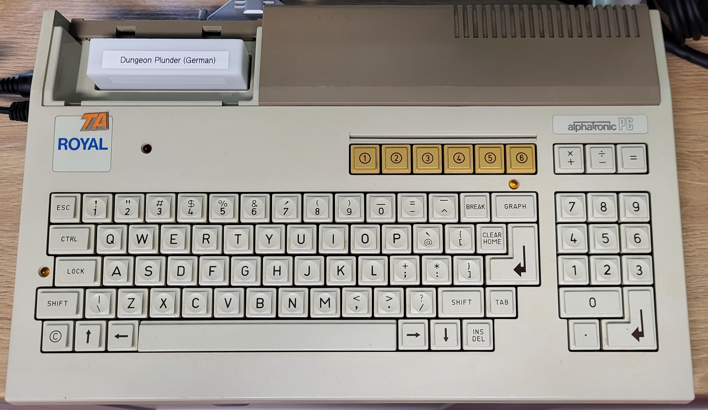
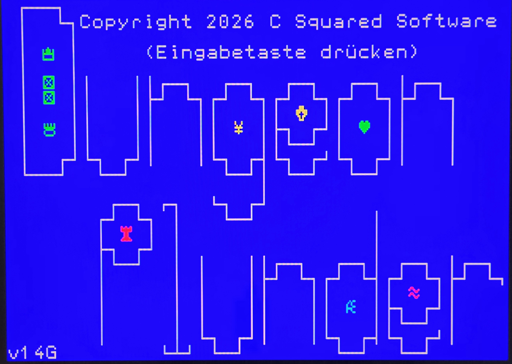
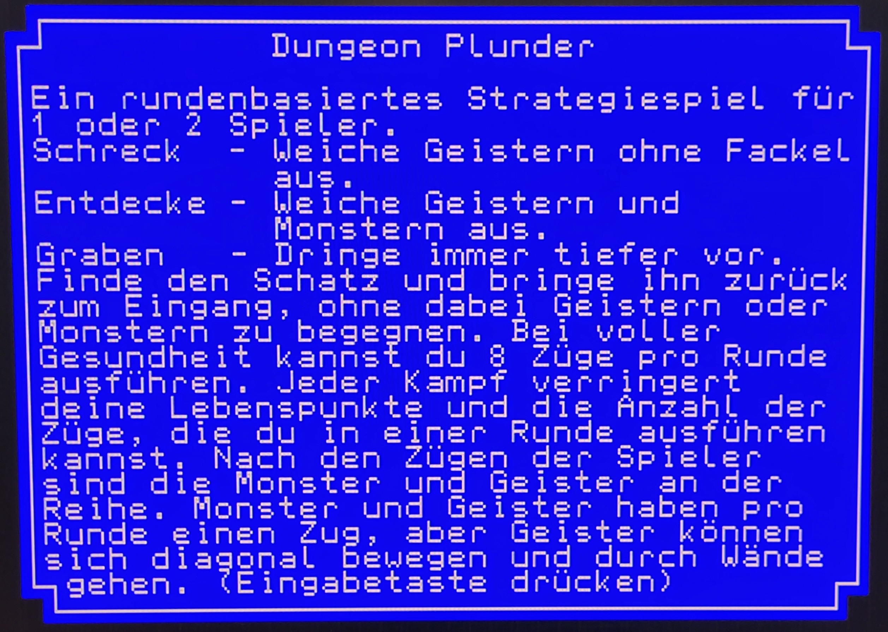
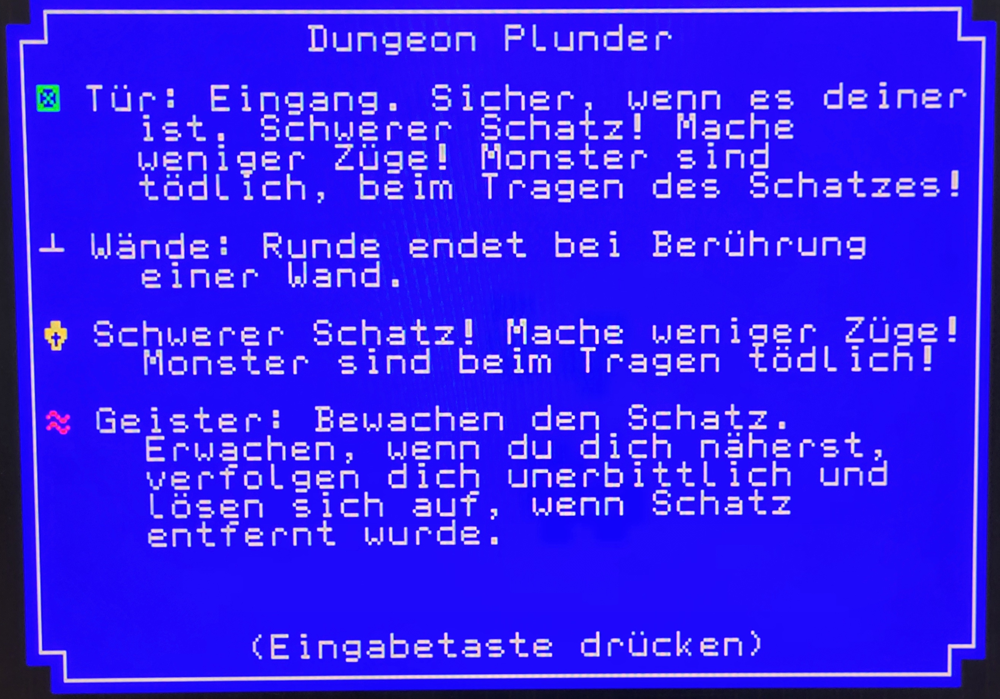
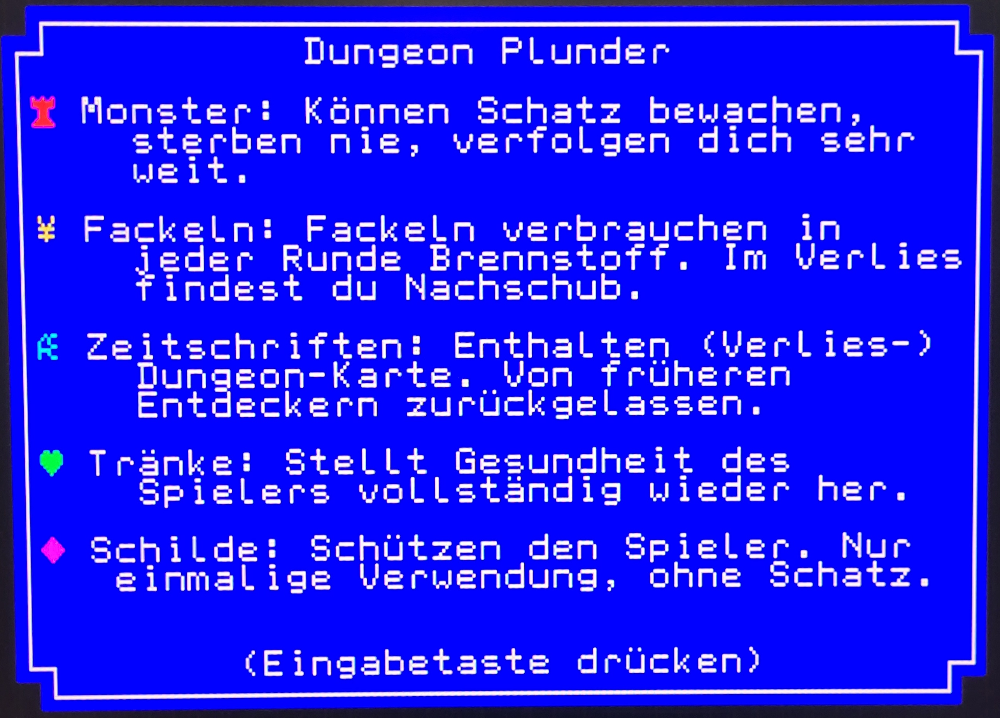
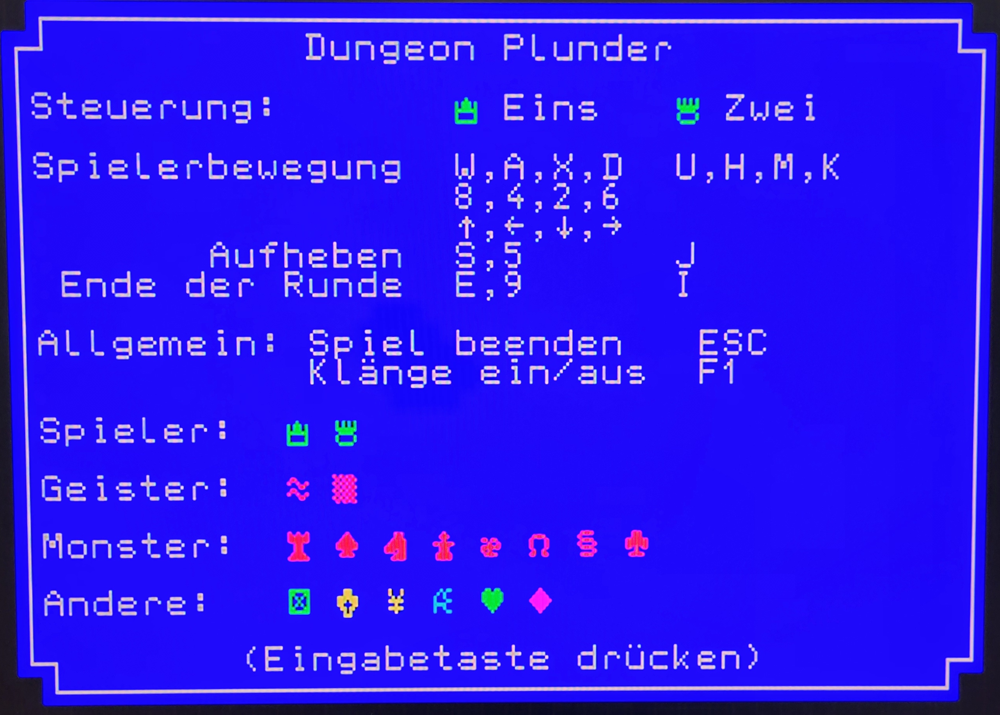
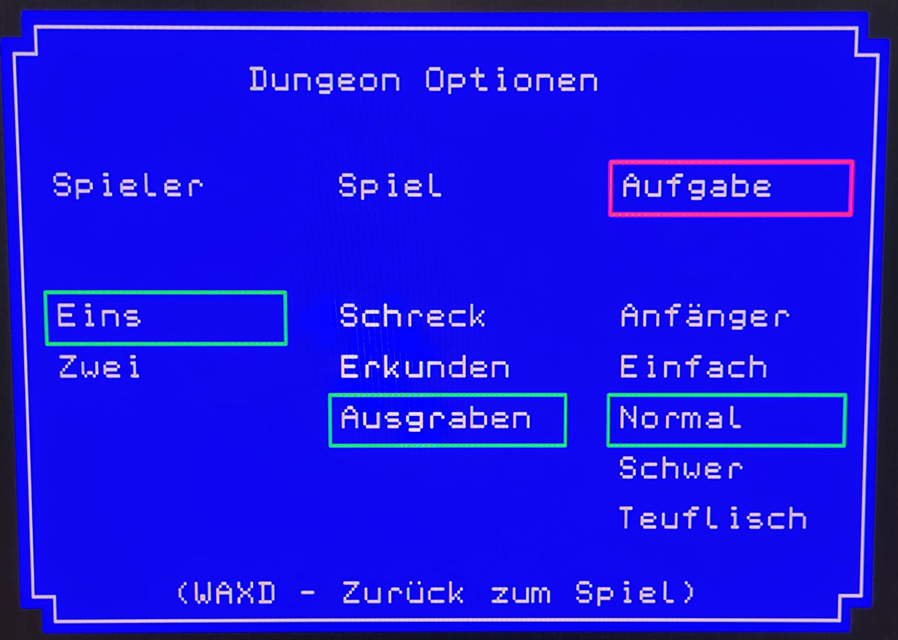
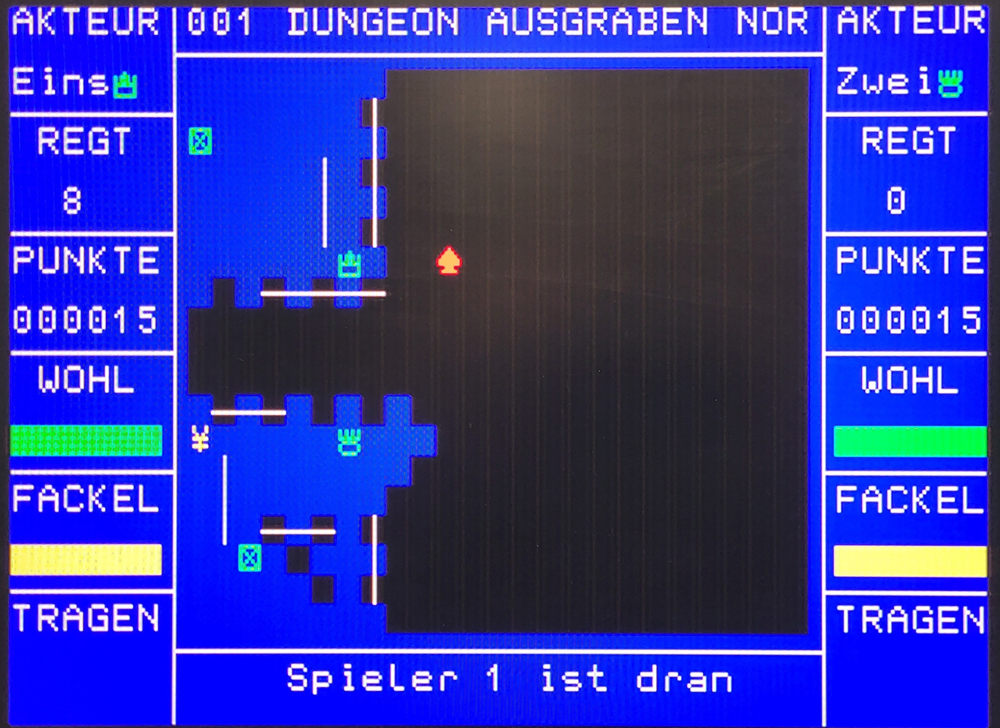

# Dungeon Plunder for the Triumph Adler Royal Alphatronic PC (8)

\
\
Developed as a stand alone, 16K game cartridge. Available in English and German.
\
\
Binary file assembled for Eprom(s) from 0xA000 to 0xDFFF.
\
\
Demo Computer:\

\
\
Welcome Screen:\

\
\
Instructions:\

\
\
Options:\

\
\
Gameplay:\

\\
\
\
Program (English): [Program](Releases/dpalphaE.bin)
\
\
Program (German): [Program](Releases/dpalphaG.bin)
\
\
