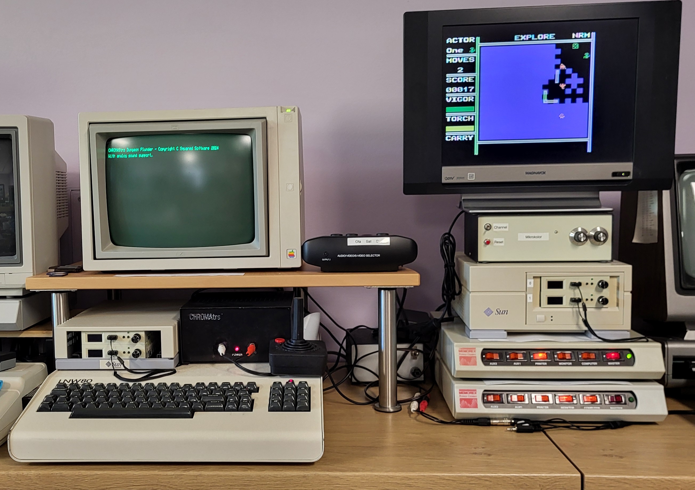

# Dungeon Plunder for TRS-80 Model 1/3 with CHROMATrs

\
\
Demonstration/Test System:
\
An LNW-80 (Model 1 clone) with  dual Gotek drives, and CHROMATrs.
\
Uses the CHROMATrs graphics (TMS9918), CHROMATrs analog audio, and CHROMATrs joysticks.
\
\

\
\
Program: [Program](Releases/DPChrom6.cmd)
\
\
Disk (NewDos80): [Disk](Releases/DPMIKR2.hfe)
\
\

