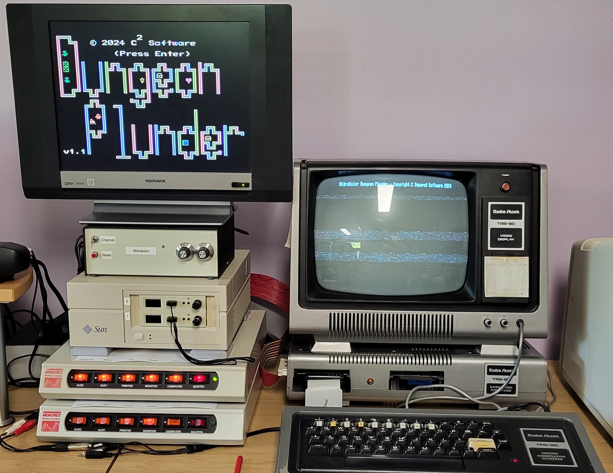

# Dungeon Plunder for TRS-80 Model 1/3 with MikroKolor-80
\
\
Demonstration/Test System:
\
A TRS-80 Model 1 with expansion interface, dual Gotek drives, and MikroKolor-80.
\
Uses the MikroKolor-80 graphics (TMS9918) and cassette bit-banged audio.
\
\

\
\
Program: [Program](Releases/dpmikro.cmd)
\
\
Disk (NewDos80): [Disk](Releases/DPMIKRO80.hfe)
\
\

